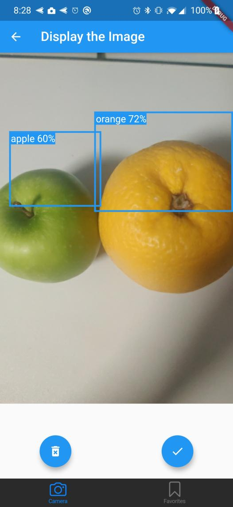

# MLPrep

[](https://github.com/MLH-Fellowship/MLPrep/pulls)

MLPrep is a mobile app that offers recipe recommendations based on a picture of the ingredients, aimed to help reduce food waste by helping users figure out a meal that maximize the usage of their available ingredients 🥗. Using machine learning, MLPrep eliminates the manual work and allows users to simply take a picture of the ingredients they want to cook with 📷, and our app will automatically recognize the ingredients in the picture and generate recipes accordingly.

## Screenshots




## Tech Stack

- Flutter/Dart for the frontend
- Tensorflow for our custom model
- Flask for the backend

## Setting Up

1. Clone the repo
```
git clone https://github.com/MLH-Fellowship/MLPrep.git
```

2. Run the backend Flask server
```
cd flask-backend
```
Follow instructions [here](./flask-backend/README.md) to set up and run the flask server.

3. Run the Flutter frontend

Follow instructions [here](./flutter-frontend/README.md) to set up and run the Flutter app.

## Contributing

[](https://github.com/MLH-Fellowship/MLPrep/issues)


We would love to have you contribute to MLPrep! Please read through the [Contributing Guide](./CONTRIBUTING.md) to know more about how you can get started with contributing to MLPrep.

## Code of Conduct

We promote an open and a welcoming environment in this community. We pledge to making participation in our project and our community a harassment-free experience for everyone. Learn more about our [Code of Conduct](./CODE_OF_CONDUCT.md).

## License

[MIT @ MLH Fellowship](./LICENSE.md)

🙌 Made by [Emily Amspoker](https://github.com/eamspoker), [Chau Vu](https://github.com/cqvu), and [Mondale Felix](https://github.com/MondaleFelix) during MLH Fellowship Explorer Sprint 3 in Fall 2020.
